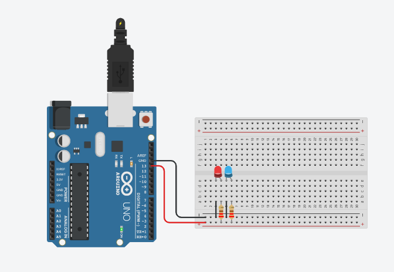

# Manipulando 2 LEDS em sequencia
 Este experimento consiste em fazer com que o LED incorporado e dois leds pisquem juntos utilizando o pino digital 13 (pino digital incorporado LED_BUILTIN = 13). 
 
## Lista de componentes:

- 1  Arduíno UNO R3
- 1  Um cabo de conexão USB
- 1  Placa de prototipação (Protoboard)
- 2  LED RGB Cátodo
- 2  Resistor de 220 Ω ohms
- 4 Jumpers (macho-macho)

## Esquema do projeto

